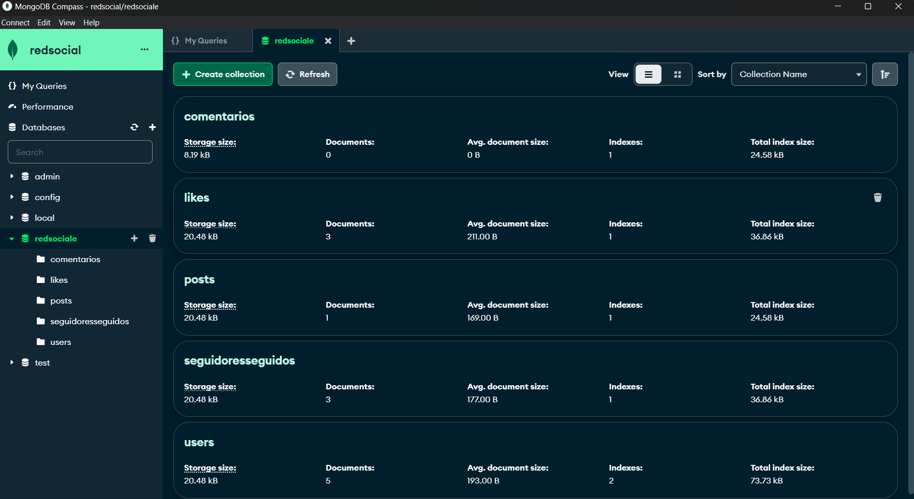
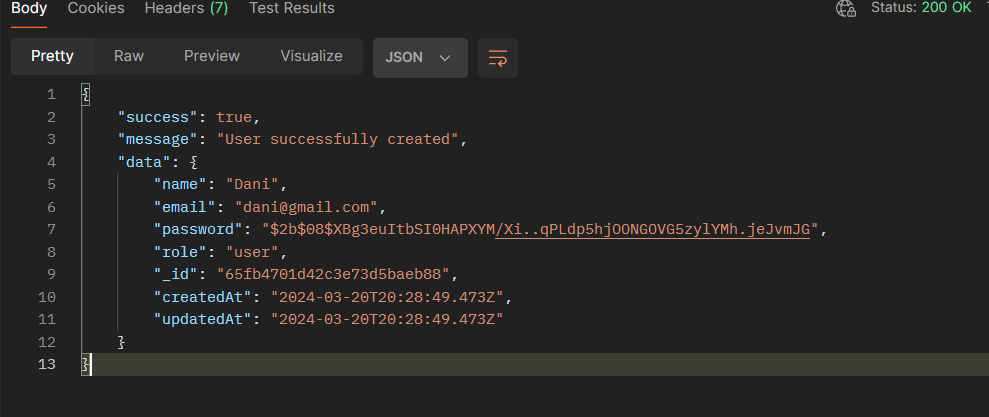
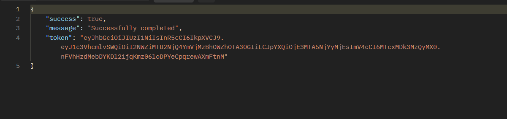
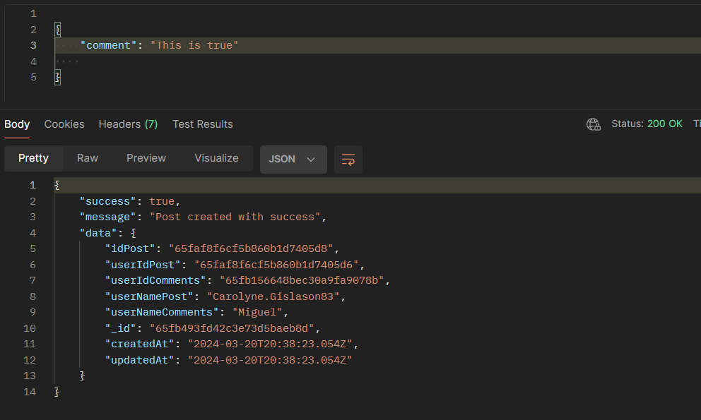
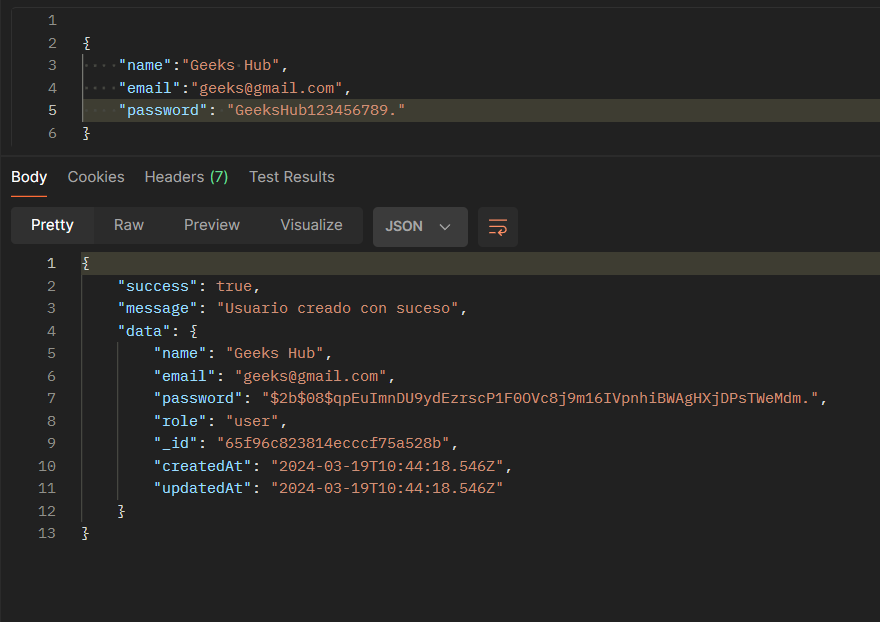
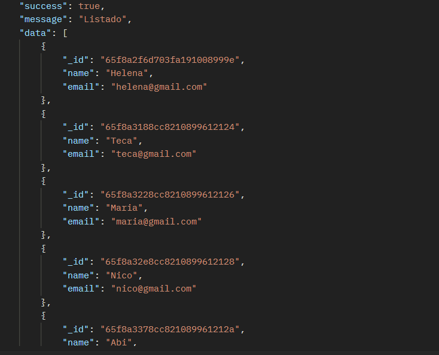
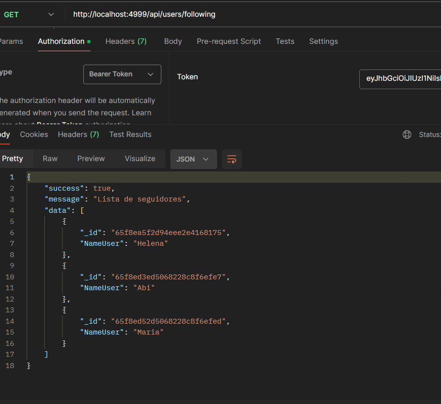
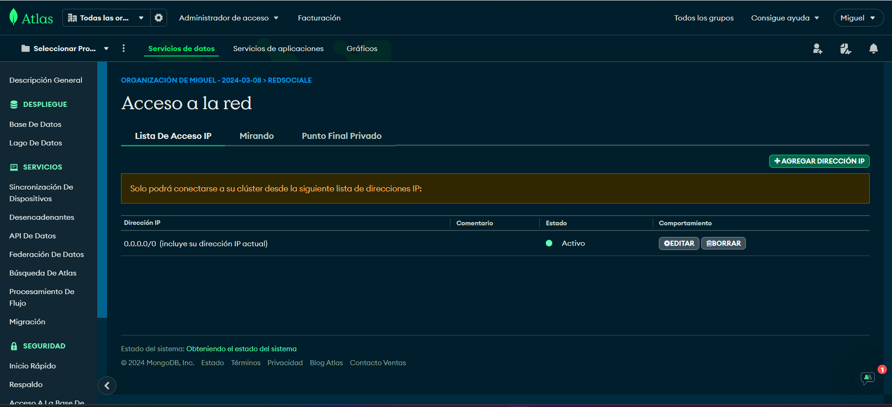
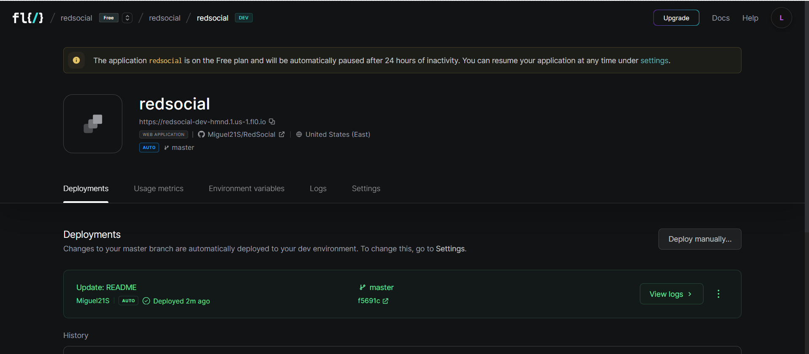

---

<ul>
<li> <a href="#social-network">Social Network</a> </li>

<li><a href="#tecnologías">Technologies</a> </li>

<li> <a href="#Database-structure-and-design">Database structure and design</a> </li>

<li> <a href="#estado-del-proyecto">Status of the Projectol</a> </li>

<li> <a href="#description-of-technologies">Description of technologies</a> </li>

<li> <a href="#endpoints">Endpoints</a> </li>

<li> <a href="./src/fichero/endpoints.md">Complete list of entpoints</a> </li>

<li> <a href="#project-start-up">Project Start-up</a> </li>

<li> <a href="#author">Author</a> </li>

</ul>

---

# Social Network

In this repository we are going to create a complete CRUD system of endpoints of a Social Network, for this we need to comply with the endpoints described in the requirements acquired for the system..

---

## Technologies


<a href="https://www.docker.com/"></a>
<a href="https://www.mongodb.com/es">  </a>
<a href="https://nodejs.org/en"></a>
<a href="https://expressjs.com/"></a>
<a href="https://www.typescriptlang.org/"></a>
<a href="https://github.com/Miguel21S"></a>
<a href="https://jwt.io/"></a>
<a href="https://www.postman.com/"></a>
<a href="https://www.npmjs.com/"></a>

---
## Description

The project consists of developing a social network in which you can register, access the network and interact with other users of the system.

In addition to what was requested for the project, an extra feature was added, that a user can follow and unfollow. 
Apart from this I have added some more features like:
Comments by id
Edit comment by id
Filter comment
Delete comment by i
List my
List users who do

## Database structure and design

Develop a social network where users will register, log in and post. In addition, users will be able to manage functionalities such as liking and unliking a post, managing comments, and following and unfollowing a user.

For these requirements you will need at least the collections:

- users
- posts
- comments
- likes
- followers

Endpoints:

Authentication

| Method | URI | Action |
| --- | --- | --- |
| POST | /api/auth/register | User registration |
| POST | /api/auth/login | User login |

users

| Method | URI | Action |
| --- | --- | --- |
| GET | /api/users | View user profile (super_admin) |
| GET | /api/users/profile | Modify profile data |
| PUT | /api/users/profile | Modificar datos del perfil |
| GET | /api/users?email=ejemplo@ejemplo.com | Filter user by email (super_admin) |
| DELETE | /api/users/{id} | Delete user (super_admin) |
| PUT | /api/users/{id}/role | Change role (super_admin) |

Posts

| Method | URI | Action |
| --- | --- | --- |
| POST | /api/posts | Create post |
| DELETE | /api/posts/{id} | Delete Post by id |
| PUT | /api/posts | Update post by id |
| GET | /api/posts/own | Retrieve my own posts  |
| GET | /api/posts | Retrieve all posts |
| GET | /api/posts/{id} | Retrieve post by id |
| GET | /api/Recuperar/{user-id} | Retrieve a user's posts |

comments

| Method | URI | Action |
| --- | --- | --- |
| POST | /comments/{id} | Create a comment  |
| PUT |/comments/{id} | Update a comment by id  |
| GET | /comments/filters | Filter comment  |
| DELETE | /comments/{id} | Delete a comment by id |

Likes

| Method | URI | Action |
| --- | --- | --- |
| PUT | /api/posts/like/{id} | Like and unlike |

followers

| Method | URI | Action |
| --- | --- | --- |
| POST | /api/users/follow/{id} | Follow and unfollow a user |
| GET | /users/following | List my followers  |
| GET | /users/followers | List users I follow  |

Otros aspectos requeridos:

- Seeders para para las diferentes colecciones.
- Midllewares para comprobar la autoía del post a la hora de editar/eliminar el mismo.
- Deploy a producción del código banckend

## Database structure and design

The image of the database modeling and the construction of some tables will be illustrated below.



The code shown below is from the UserModel


The database consists of five tables:
- The UsersModel table
- The PostsModel table that references the Users table
- The CommentsModel table that references the UsersModel table
- The LikesModel table that references the PostsModel and UsersModel models
- The table FollowersFollowersModel that makes reference to UsersModel

## Status of the Projectol

The project is concluded, since it meets all the requirements acquired for the system provided, which is the creation of a Social Network on behalf of the bankend.

for the execution of the project in local install some dependencies of the technologies used in the project, as well as:

Clone repository

```
$ git clone https://github.com/Miguel21S/RedSocial.git
```
For the execution of seeders 

```
$ npm run seeders
```

## Endpoints

Auth Controllers POST
```
https://redsocial-dev-qsfd.2.us-1.fl0.io/api/auth/register
```
```jsx
{
    "name":"Dani",
    "email":"dani@gmail.com",
    "password": "Dani123456789."
}
```


Login  POST
```jsx
https://redsocial-dev-qsfd.2.us-1.fl0.io/api/auth/login
```
```jsx
{
    "email":"miguel@gmail.com",
    "password": "Miguel12345."
}
```


Creat Comment POST by idPost
```jsx
https://redsocial-dev-qsfd.2.us-1.fl0.io/api/comment/

```
```jsx
{
    "comment": "This is true"
    
} 
```



---

<a href="./src/fichero/endpoints.md">Complete list of entpoints</a>

## Project Start-up
For the correct functioning of the project, several classes will be developed, which will be illustrated with code examples.

The following methods are from the midleware.

The following method checks whether the user has an access token or not by storing a header and authorization value in the token variable.

```tsx
import { NextFunction, Request, Response } from "express";
import jwt from "jsonwebtoken";
import { TokenData } from "../../types";
import { CustomError, ServerError, UnauthorizedError } from "../utils/manejoErrores";

export interface CustomRequest extends Request {
    tokenData: TokenData;
}

export const auth = async (req: CustomRequest, res: Response, next: NextFunction) => {
    try {
        const token = req.headers.authorization?.split(" ")[1];
        if (!token) {
           throw new UnauthorizedError( 'Usuario no autorizado' )
        }
        const decode = jwt.verify(
            token,
            process.env.JWT_SECRET as string,
        )
        req.tokenData = decode as TokenData;
        next();
    } catch (error) {
        if( error instanceof CustomError ){
            error.sendResponse(res);

        } else {
            
            const serverError = new ServerError();
            serverError.sendResponse(res);
        }
    }
};

```

The following image shows the registration of a user in the system.




The following lines will show some codes of different endpoints with different functionalities.

The following method defines the number of elements to be displayed on each page, and the limit of elements set by the user. The method consists of displaying all the users of the system.

```tsx
const ListarTodosUsuarios = async (req: Request, res: Response) => {
    try {
        let limit = Number(req.query.limit) || 5
        const page = Number(req.query.page) || 1
        const skip = (page - 1) * limit
        const lista = await UserModel.find()
            .select("name")
            .select("email")
            .limit(limit)
            .skip(skip);
            
        res.status(200).json(
            {
                success: true,
                message: "Listado",
                data: lista
            }
        )
   
    } catch (error) {
           if( error instanceof CustomError){
            error.sendResponse(res);

           } else {

            const serverError = new ServerError();
            serverError.sendResponse(res);
           }
        
    }
};
```

The following image shows the visualization of the system users in a scale of 1 to 5 per page. Super Admin accessing the visualization of the users since he is the only one that has permission to visualize all the users of the system.



The following method displays a list of your followers.

```tsx
const listarMisSeguidores = async (req: Request, res: Response) => {
    try {
        const userId = req.tokenData.usuarioId;
        let limit = Number(req.query.limit) || 10
        const page = Number(req.query.page) || 1
        const skip = (page - 1) * limit

        const user = await UserModel.findOne({ _id: userId });
        if (!user) {
            throw new NotFoundError( 'No se encontraron datos del usuario en la solicitud' );
        }

        const misSeguidores = await SeguidoresSeguidosModel.find( { idUserSiguiendo: userId, estadoSeguiendo: 1 } )
        .select("NameUser")
        .limit(limit)
        .skip(skip)

        res.status(200).json({
            success: true,
            message: "Lista de seguidores",
            data: misSeguidores
        });

    } catch (error) {
        if (error instanceof CustomError) {
            error.sendResponse(res);
        } else {
            const serverError = new ServerError();
            serverError.sendResponse(res);
        }
    }
}
```

You can visualize the search of followers in the following image.



In this class `server.ts` is the main class of the program.

```tsx
import express, { Application } from "express";
import bodyParser from "body-parser";
import "dotenv/config";
import { dbConnection } from "./core/database/db";
import routerController from "./entities/controllers/routes";
import routerUser from "./entities/users/routes";
import routerPost from "./entities/posts/routes";
import routerComentario from "./entities/comentarios/routes";
import routerLike from "./entities/likes/routes";
import routerSeguirSiguiendo from "./entities/seguidoreSeguidos/routes"


const app: Application = express();
const PORT = process.env.PORT || 4998;
app.use(bodyParser.json());

app.use('/api', routerController);
app.use('/api', routerUser);
app.use('/api', routerPost);
app.use('/api', routerComentario);
app.use('/api', routerLike);
app.use('/api', routerSeguirSiguiendo);

dbConnection()
    .then(() => {
        console.log('Database connected');
    })
    .catch(error => {
        console.log(error)
    })

app.listen(PORT, () => {
    console.log(`Server running on port ${PORT}`);
});

```
---
For the deployed was made the utility of MongoDB Atlas cloud for the management of the database in the cloud as you can see in the following image.
 
 https://www.mongodb.com/es/atlas/database



For the deployment of the project, the flo app was used.
https://www.fl0.com/



---
<a href="leaismiguelss@gmail.com"> </a>

## Author:

Name: Miguel Bengui
