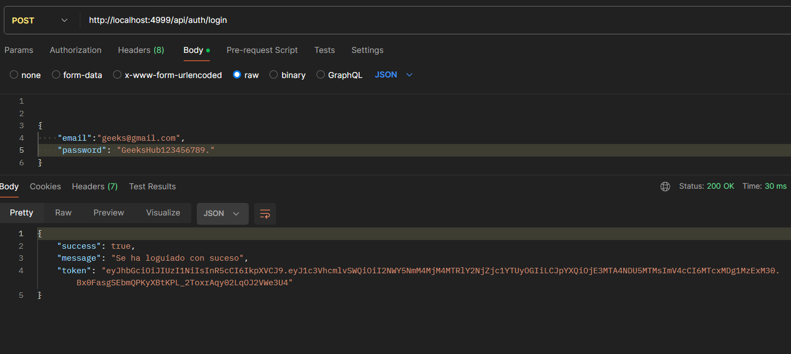
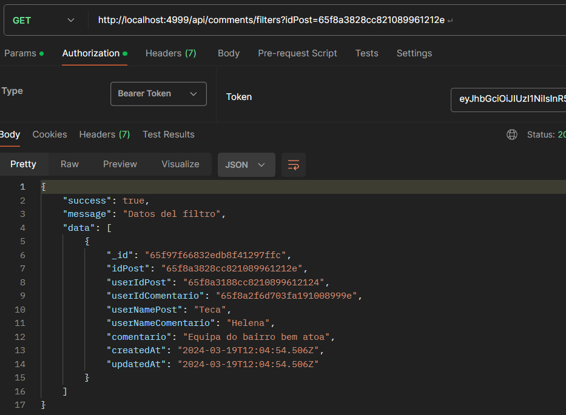
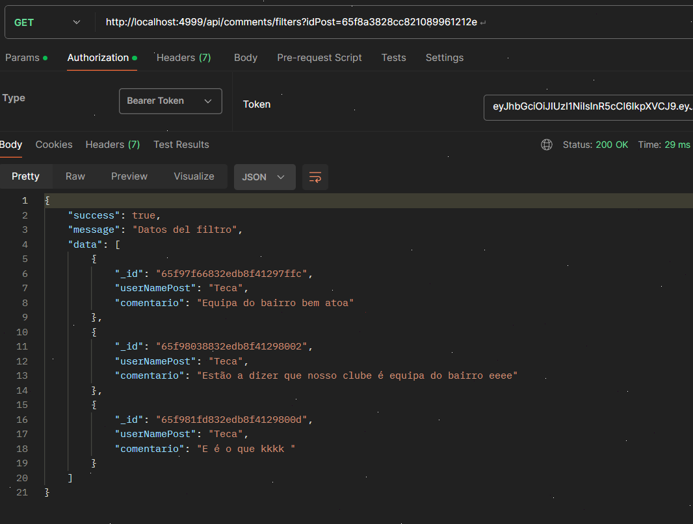
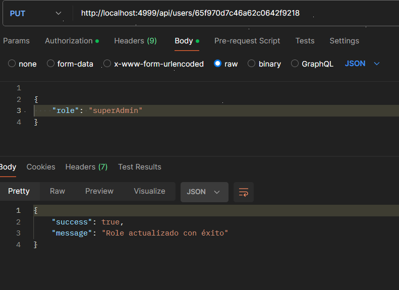
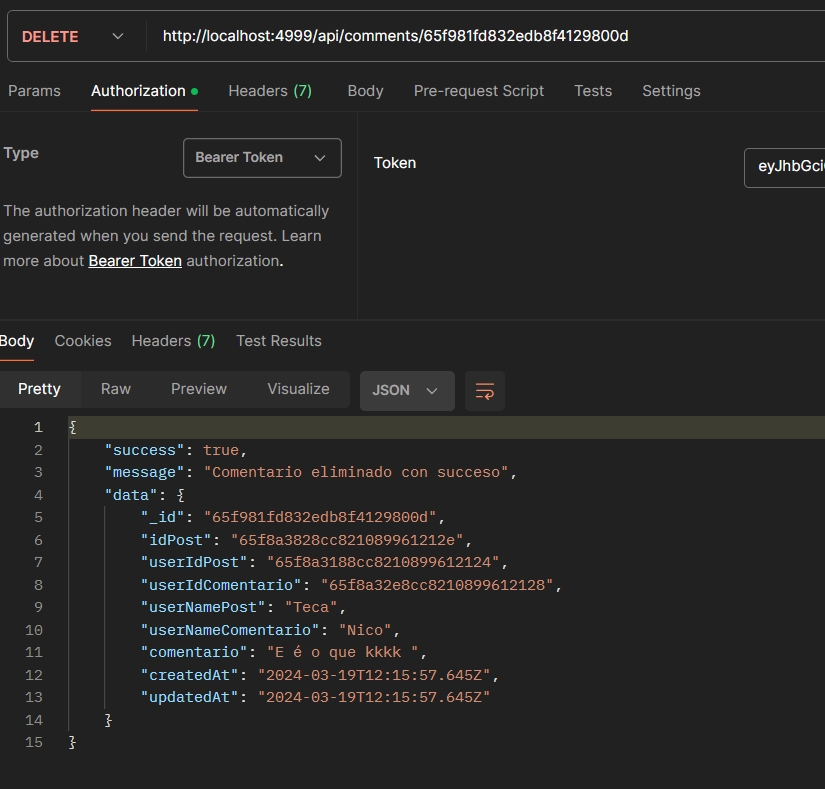
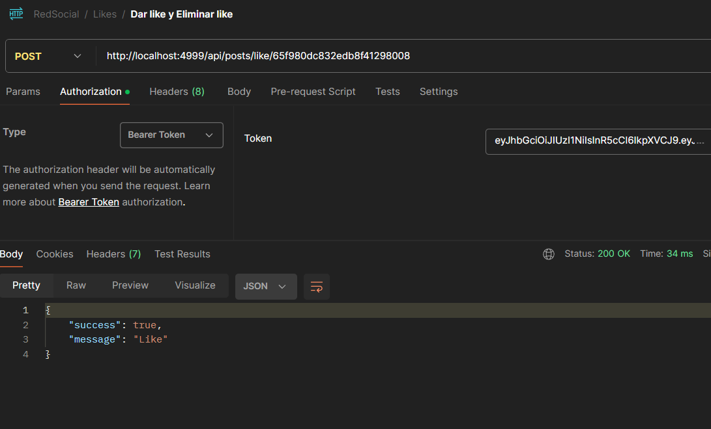
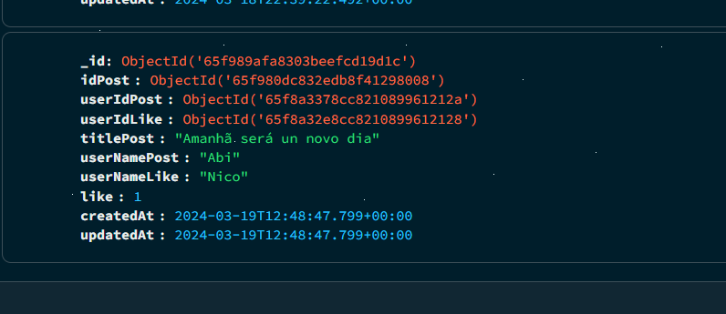

---

<ul>
<li> <a href="#red-social">Red Social</a> </li>

<li><a href="#tecnologías">Tecnologías</a> </li>

<li> <a href="#descripción">Descripción</a> </li>

<li> <a href="#estructura-y-diseño-de-la-base-de-datos">Estructura y diseño de la base de datos</a> </li>

<li> <a href="#estado-del-proyecto">Estado del Proyectol</a> </li>

<li> <a href="#descripción-de-las-tecnologías">Descripción de las tecnologías</a> </li>

<li> <a href="#puesta-en-marcha-del-proyecto">Puesta en Marcha del Proyecto</a> </li>

<li> <a href="#autor">Autor</a> </li>

</ul>

---

# Red Social

En este repositorio se van a crear un sistema CRUD completo de endpoints de una Red Social, para esto se necesita cumplir con los endpoints descripto en los requisitos adquiridos para el sistema.

---

## Tecnologías


---
## Descripción

El proyeto consiste en desarrollar una red social en las que se puede registrarse, accerder a la red e interactuar, con los demás usuarios del sistema.

## Requisitos funcionales

Desarrolar una red social en la que los usuarios se registrarán, logearán y publicarán. Además los usuarios podrán gestionar las funcionalidades como gustar y dejar de gustar a una publicación, gestionar los comentarios, y seguir y dejar de seguir a un usuario.

Para estes requisitos se necesitarán como minimo las colecciones:

- usuario
- posts
- comentarios
- likes
- seguidores

Endpoints:

Autenticación

| Método | URI | Acción |
| --- | --- | --- |
| POST | /api/auth/register | Registro de usuarios |
| POST | /api/auth/login | Login de usuarios |

Usuarios

| Método | URI | Acción |
| --- | --- | --- |
| GET | /api/users | Ver todos los usuarios (super_admin) |
| GET | /api/users/profile | Ver perfil de usuario |
| PUT | /api/users/profile | Modificar datos del perfil |
| GET | /api/users?email=ejemplo@ejemplo.com | Filtrar usuario por email (super_admin) |
| DELETE | /api/users/{id} | Eliminar usuario (super_admin) |
| PUT | /api/users/{id}/role | Cambio de role (super_admin) |

Posts

| Método | URI | Acción |
| --- | --- | --- |
| POST | /api/posts | Crear post |
| DELETE | /api/posts/{id} | Eliminar Post por id |
| PUT | /api/posts | Actualizar post por id |
| GET | /api/posts/own | Recuperar mis propios posts |
| GET | /api/posts | Recuperar todos los posts |
| GET | /api/posts/{id} | Recuperar post por id |
| GET | /api/Recuperar/{user-id} | Recuperar posts de un usuario |

Comentarios

| Método | URI | Acción |
| --- | --- | --- |
| POST | /comments/{id} | Crear un comentario |
| PUT |/comments/{id} | Actualizar un comentario por id  |
| GET | /comments/filters | Filtrar comentario  |
| DELETE | /comments/{id} | Eliminar un comentario por id  |

Likes

| Método | URI | Acción |
| --- | --- | --- |
| PUT | /api/posts/like/{id} | Dar y quitar like |

Seguir

| Método | URI | Acción |
| --- | --- | --- |
| POST | /api/users/follow/{id} | Seguir y dejar de seguir un usuario |
| GET | /users/following | Listar mis seguidores  |
| GET | /users/followers | Listar usuarios que sigo  |

Otros aspectos requeridos:

- Seeders para para las diferentes colecciones.
- Midllewares para comprobar la autoía del post a la hora de editar/eliminar el mismo.
- Deploy a producción del código banckend

## Estructura y diseño de la base de datos

En seguida se mustrarán la imagen del modelado de base de datos y la construcción de algunas tablas


El código que se muestra a continuación es del UserModel

```tsx
import { Schema, model, Document, Types } from "mongoose";

interface User extends Document {
    name: string;
    email: string;
    password: string;
    role: string;
    seguidores?: Schema.Types.ObjectId;
    siguiendo?: Schema.Types.ObjectId[];
}

const UserSchema = new Schema<User>(
    {
        name: {
            type: String,
            required: false,
        },

        email: {
            type: String,
            required: false,
            unique: true,
        },

        password: {
            type: String,
            required: false,
        },

        role: {
            type: String,
            enum: ["user", "admin", "superAdmin"],
            default: "user",
        },

    },
    {
        timestamps: true,
        versionKey: false,
    }
)

const UserModel = model<User>("User", UserSchema);

export default UserModel;
```

A continuación se muestra la construcción del LikesModel
```tsx
import { Document, Schema, model } from "mongoose"

interface Likes extends Document {
    idPost: Schema.Types.ObjectId;
    userIdPost: Schema.Types.ObjectId;
    userIdLike: Schema.Types.ObjectId;
    titlePost: string;
    userNamePost: string;
    userNameLike: string;
    like: number;
}

const likesSchema = new Schema<Likes>(
    {
        idPost:
        {
            type: Schema.Types.ObjectId,
            ref: "PostModel"
        },

        userIdPost:
        {
            type: Schema.Types.ObjectId,
            ref: "PostModel"
        },

        userIdLike:
        {
            type: Schema.Types.ObjectId,
            ref: "UserModel"
        },

        titlePost: String,
        userNamePost: String,
        userNameLike: String,
        like: Number,
    },

    {
        timestamps: true,
        versionKey: false,
    }
)

const LikeModel = model<Likes>("Likes", likesSchema);
export default LikeModel;
```

La base de datos consta de cinco tablas:

- La tabla UsersModel
- La tabla PostsModel que hace referencia en la tabla Usuarios
- La tabla ComentariosModel que hace referencia a la tabla Usuarios
- La tabla LikesModel que hace referencia a los modelos de PostsModel y UsersModel
- La tabla SeguidoresSeguidosModel que hace referencia a UsersModel

## Estado del Proyecto

El proyecto se encuentra concluido, ya que cumple con todos los requisitos adquirido para el sistema propocionado, que es la creación de una Red Social de parte del bankend.

## Para el funcionamieto en entorno local
Se necesita seguir los siguientes pasos:

Clonar repositorio

```
$ git clone https://github.com/Miguel21S/BackeEndTatu.git
```
Instalar la dependencia
```
$ npm install
```
Para crear las migraciones
```
$ npm run ....
```
Para rellenar las tablas de base de datos
```
$ npm run seeders ....
```
Para la inicialización de la app
```
npm run dev
```

## Puesta en Marcha del Proyecto
Para el correcto funcionamiento del proyecto, se desarrollará varias clases, que se ilustrarán con ejemplos de código.

Los siguientes métodos son de los midleware.

El siguiente método comprueba si el usuario tiene un token de acceso o no almacenado en la variable token un valor de cabezera y de autorización.

```tsx
import { NextFunction, Request, Response } from "express";
import jwt from "jsonwebtoken";
import { TokenData } from "../../types";
import { CustomError, ServerError, UnauthorizedError } from "../utils/manejoErrores";

export interface CustomRequest extends Request {
    tokenData: TokenData;
}

export const auth = async (req: CustomRequest, res: Response, next: NextFunction) => {
    try {
        const token = req.headers.authorization?.split(" ")[1];
        if (!token) {
           throw new UnauthorizedError( 'Usuario no autorizado' )
        }
        const decode = jwt.verify(
            token,
            process.env.JWT_SECRET as string,
        )
        req.tokenData = decode as TokenData;
        next();
    } catch (error) {
        if( error instanceof CustomError ){
            error.sendResponse(res);

        } else {
            
            const serverError = new ServerError();
            serverError.sendResponse(res);
        }
    }
};

```

Este método comprueba si el usuario es un super admin del sistema, ya que el super admin tiene ciertos privilegios en el sistema.

```tsx

import { NextFunction, Request, Response } from "express";
import { CustomRequest } from "../../core/middlewares/auth"
import UserModel from "../../entities/users/UsersModel";
import { CustomError, NotFoundError, ServerError, UnauthorizedError } from "../utils/manejoErrores";

export const isSuperAdmin = async (req: CustomRequest, res: Response, next: NextFunction) => {
    try {
        let userRole;
        const user = await UserModel.findById(
            {
                _id: req.tokenData.usuarioId
            }
        )
        if (!user) {
            throw new NotFoundError('No se encontraron datos de usuario en la solicitud');

        }

        userRole = user.role
        if( userRole !== "superAdmin"){
            throw new UnauthorizedError( 'Usuario no autorizado' )
        }
        next();
    } catch (error) {
        if( error instanceof CustomError){
            error.sendResponse(res);

        } else {
            const serverError = new ServerError();
            serverError.sendResponse(res);
            
        }
    }
}
```

El siguiente código es del método `registrar`

```tsx
import { Request, Response } from "express";
import bcrypt from "bcrypt";
import jwt from "jsonwebtoken";
import UserModel from "../users/UsersModel";
import  { CustomError, ServerError } from "../../core/utils/manejoErrores";

const registrar = async (req: Request, res: Response) => {
    try {
        const name = req.body.name;
        const email = req.body.email;
        const password = req.body.password;

        const validPwd = /^(?=.*\d)(?=.*[!\"#\$%&'()*+,-./:;<=>?@[\\\]^_])(?=.*[A-Z])(?=.*[a-z])\S{8,}$/
        if(password.length < 8){
            return res.status(404).json({
                success: false,
                message: "La contraseña debe más de 8 caracteres"
            })
        }

        if (!validPwd.test(password)) {
            return res.status(404).json({
                success: false,
                message: "La contraseña debe tener al menos un dígito, un carácter especia, una letra mayúscula, una letra minúscula, y que no tenga espacio."
            })
        }

        const validEmail = /^\w+([.-_+]?\w+)*@\w+([.-]?\w+)*(\.\w{2,10})+$/;
        if (!validEmail.test(email)) {
            return res.status(400).json(
                {
                    success: false,
                    message: "formato de email invalido"
                }
            )
        }

        const pwdEncryptado = bcrypt.hashSync(password, 8)

        const crearNuevoUser = await UserModel.create(
            {
                name: name,
                email: email,
                password: pwdEncryptado
            }
        )

        res.status(200).json(
            {
                success: true,
                message: "Usuario creado con suceso",
                data: crearNuevoUser
            }
        )
    } catch (error) {
        if(error instanceof CustomError){
            error.sendResponse(res)

        } else {

            const serverError = new ServerError();
            serverError.sendResponse(res)
        }
    }
}
```

Al desarrollar este código, se incorporaron algunas validaciones esenciales para cumplir con los requisitos mínimos de un sistema de `registro`. Estos incluyen la validación de formato de un correo electrónico, contraseña y la encriptación de la contraseña.

La siguiente imagen muestra el registro de un usuario en el sistema.


Las siguientes líneas de código explican claramente cómo se creó el método de inicio de sesión y las validaciones que se implementarán. Además, se describe la funcionalidad para la creación del token de acceso, garantizando que solo los usuarios registrados puedan acceder al sistema.

```tsx
const login = async (req: Request, res: Response) => {
    try {
        const email = req.body.email;
        const password = req.body.password;

        if (!email || !password) {
            return res.status(404).json(
                {
                    success: false,
                    mesage: "Datos del login incorrecto"
                }
            )
        }

        const user = await UserModel.findOne(
            {
                email: email
            }
        ).select("password")

        if (!user) {
            return res.status(404).json(
                {
                    success: false,
                    mesage: "Dato incorrecto"
                }
            )
        }

        const validarPwd = bcrypt.compareSync(password, user!.password);
        
        if (!validarPwd) {
            return res.json(
                {
                    success: false,
                    mesage: "Password invalido"
                }
            )
        }

        const token = jwt.sign(
            {
                usuarioId: user._id,
                usuarioName: user.role
            },
            process.env.JWT_SECRET as string,
            {
                expiresIn: "2h"
            }
            
        )
 
        res.status(200).json({
            success: true,
            message: "Se ha loguiado con suceso",
            token: token,
        });
    } catch (error) {
        if(error instanceof CustomError){
            error.sendResponse(res)

        } else {

            const serverError = new ServerError();
            serverError.sendResponse(res)
        }
    }
}
```
En la imagen de que se muestra a continuación se muestra que el usuario se ha logeado con sucesso y que ha recibido un token de acceso


Las siguientes lineas se mostrarán algunos códigos de diferentes endpoints con diferentes funcionalidades.

El siguiente método se define los números de elementos a mostrar en cada pagina, y el limite de elementos establecido por el usuario. El método consiste en visualizar todos los usuarios del sistema.

```tsx
const ListarTodosUsuarios = async (req: Request, res: Response) => {
    try {
        let limit = Number(req.query.limit) || 5
        const page = Number(req.query.page) || 1
        const skip = (page - 1) * limit
        const lista = await UserModel.find()
            .select("name")
            .select("email")
            .limit(limit)
            .skip(skip);
            
        res.status(200).json(
            {
                success: true,
                message: "Listado",
                data: lista
            }
        )
   
    } catch (error) {
           if( error instanceof CustomError){
            error.sendResponse(res);

           } else {

            const serverError = new ServerError();
            serverError.sendResponse(res);
           }
        
    }
};
```

En las siguientes imagen se muestra la visualizacion de usuarios del sistemas en una escala de 1 a 5 por paginas. Super Admin accediendo la visualización de los usuarios ya que es el único que tiene permisión para visualizar todos los usuarios del sistema


El siguiente método filtra busqueda de un comentario por Id del comentario, post, y nombre del usuario. Para este método se creo una interface y un objecto vacio de tipo queryFiltersI, y se comprueba su busqueda mediante método `find()`.

```tsx
const buscarComentario = async (req: Request, res: Response) => {
    try {
        const userId = req.tokenData.usuarioId;
        const { idComentario, idPos, userName } = req.query;
        let limit = Number(req.query.limit) || 10
        const page = Number(req.query.page) || 1
        const skip = (page - 1) * limit

        interface queryfiltrsI {
            idComentario?: Types.ObjectId;
            idPost?: Types.ObjectId;
            userName?: string;
        }

        const queryfiltrs: queryfiltrsI = {}
        if (idComentario && Types.ObjectId.isValid(idComentario as string)) {
            queryfiltrs.idComentario = new Types.ObjectId(idComentario as string)
        }

        if (idPos && Types.ObjectId.isValid(idPos as string)) {
            queryfiltrs.idPost = new Types.ObjectId(idPos as string);
        }

        if (userName) {
            queryfiltrs.userName = userName as string
        }

        const mostrarIdComentario = await ComentarioModel.find(queryfiltrs)
        .limit(limit)
        .skip(skip)

        res.status(200).json(
            {
                success: true,
                message: "Datos del filtro",
                data: mostrarIdComentario
            }
        )

    } catch (error) {
        if( error instanceof CustomError){
            error.sendResponse(res);
            
        } else {
            const serverError = new ServerError();
            serverError.sendResponse(res);
        }
    }
}
```

La siguiente imagen muestra el resultado de la busqueda.





El siguiente método tiene la funcionalidad de actualizar role de un usuario en sistema.

```tsx
const actualizarRolePorId = async (req: Request, res: Response) => {
    try {
        const userId = req.params.id;
        const role = req.body.role;

        const updateRole = await UserModel.findOneAndUpdate(
            {
                _id: userId
            },
            {
                role: role
            },
            {
                new: true
            }
        )

        if (!updateRole) {
            throw new NotFoundError( 'No se encontraron datos en la solicitud' )
        }

        res.status(200).json({
            success: true,
            message: "Role actualizado con éxito"
        });
    } catch (error) {
        if( error instanceof CustomError){
            error.sendResponse(res);

        } else {
            const serverError = new ServerError();
            serverError.sendResponse(res);
            
        }
    }
}
```

En la siguiente imagen se puede ver como se ha actualizado el role de usuario.



El siguiente método tiene la funcionalidad de elimina un comentario

```tsx
const eliminarComentario = async (req: Request, res: Response) => {
    try {
        const userId = req.tokenData.usuarioId;
        const idComentario = req.params.id;

        const user = await UserModel.findOne({ _id: userId });

        const comentarioId = await ComentarioModel.findOne({ _id: idComentario });
        if (!comentarioId) {
            throw new NotFoundError('No se encontraron datos del comentario en la solicitud');
        }

        const donoPostId = await ComentarioModel.findOne({ userIdPost: user?.id })

        const donoIdUserComentario = await ComentarioModel.findOne(
            {
                userIdComentario: user?.id,
                _id: comentarioId

            }
        )

        if (!donoPostId && !donoIdUserComentario) {
            throw new ForbiddenError( 'Usuario no permitido' )
        }

        const comentarioEliminar = await ComentarioModel.findByIdAndDelete(comentarioId);
        return res.status(200).json(
            {
                success: true,
                message: "Comentario eliminado con succeso",
                data: comentarioEliminar
            }
        )

    } catch (error) {
        if( error instanceof CustomError){
            error.sendResponse(res);
            
        } else {
            const serverError = new ServerError();
            serverError.sendResponse(res);
        }
    }
}
```

En la siguiente imagen se puede visualizar que se ha eliminado el comentario.



El código que se muestra a continuación sirve para dar y quitar like a un post, en esté método despues de eliminar el like no se quita el registro en la base de datos
```tsx
const darlikes = async (req: Request, res: Response) => {
    try {
        const userId = req.tokenData.usuarioId;
        const postId = req.params.id;
        let like = 1;

        const user = await UserModel.findOne({ _id: userId });
        if (!user) {
            throw new NotFoundError(' No se encontraron datos de usuario en la solicitud ');
        }

        const post = await PostModel.findOne({ _id: postId });
        if (!post) {
            throw new NotFoundError(' No se encontraron datos del en la solicitud ');
        }

        const existLike = await LikeModel.findOne(
            {
                idPost: postId,
                userIdLike: userId,
            }
        )

        if (existLike) {

            like = existLike.like === 1 ? 0 : 1;
            existLike.like = like;
            await existLike.save();

        } else {
            
            await LikeModel.create(
                {
                    like: like,
                    idPost: post?._id,
                    userIdPost: post?.userIdPost,
                    userIdLike: user?._id,
                    titlePost: post?.title,
                    userNamePost: post.userName,
                    userNameLike: user?.name
                }
            )
        }

        res.status(200).json(
            {
                success: true,
                message: "Like",
            }
        )
    } catch (error) {
        if( error instanceof CustomError ){
            error.sendResponse(res);

        } else {
            
            const serverError = new ServerError();
            serverError.sendResponse(res);
        }
    }
}
```

Se puede visualizar la información del usuario que el like se ha almacenado o enviado, en la siguiente imagen.





El siguiente método muetra una lista de sus seguidores.

```tsx
const listarMisSeguidores = async (req: Request, res: Response) => {
    try {
        const userId = req.tokenData.usuarioId;
        let limit = Number(req.query.limit) || 10
        const page = Number(req.query.page) || 1
        const skip = (page - 1) * limit

        const user = await UserModel.findOne({ _id: userId });
        if (!user) {
            throw new NotFoundError( 'No se encontraron datos del usuario en la solicitud' );
        }

        const misSeguidores = await SeguidoresSeguidosModel.find( { idUserSiguiendo: userId, estadoSeguiendo: 1 } )
        .select("NameUser")
        .limit(limit)
        .skip(skip)

        res.status(200).json({
            success: true,
            message: "Lista de seguidores",
            data: misSeguidores
        });

    } catch (error) {
        if (error instanceof CustomError) {
            error.sendResponse(res);
        } else {
            const serverError = new ServerError();
            serverError.sendResponse(res);
        }
    }
}
```

Se puede visualizar la buscada de seguidores en la siguiente imagen.


En esta clase `server.ts` es la clase principal del programa

```tsx
import express, { Application } from "express";
import bodyParser from "body-parser";
import "dotenv/config";
import { dbConnection } from "./core/database/db";
import routerController from "./entities/controllers/routes";
import routerUser from "./entities/users/routes";
import routerPost from "./entities/posts/routes";
import routerComentario from "./entities/comentarios/routes";
import routerLike from "./entities/likes/routes";
import routerSeguirSiguiendo from "./entities/seguidoreSeguidos/routes"


const app: Application = express();
const PORT = process.env.PORT || 4998;
app.use(bodyParser.json());

app.use('/api', routerController);
app.use('/api', routerUser);
app.use('/api', routerPost);
app.use('/api', routerComentario);
app.use('/api', routerLike);
app.use('/api', routerSeguirSiguiendo);

dbConnection()
    .then(() => {
        console.log('Database connected');
    })
    .catch(error => {
        console.log(error)
    })

app.listen(PORT, () => {
    console.log(`Server running on port ${PORT}`);
});

```
---
Para el deployed se hizo la utilidad del cloud de MongoDB Atlas para la gestion de la base de datos en la nube como se puede ver en la siguiente imagen
 https://www.mongodb.com/es/atlas/database


Para el despliegue del proyecto se utilizo la app del flo 
https://www.fl0.com/


---


## Autor:

Name: Miguel Bengui
