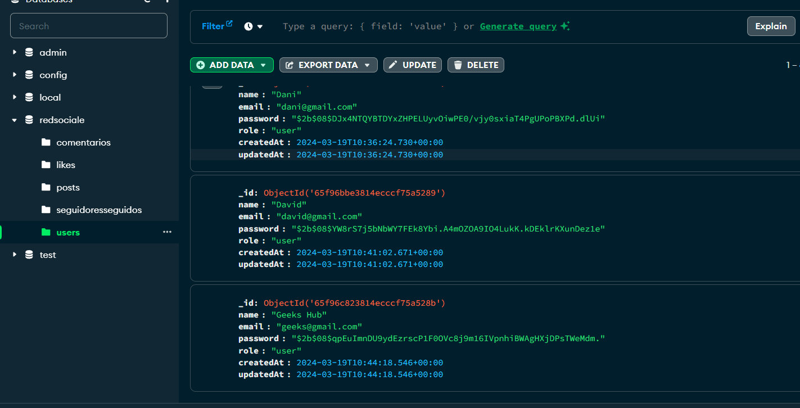

---

<ul>
<li> <a href="#red-social">Social Network</a> </li>

<li><a href="#tecnologías">Technologies</a> </li>

<li> <a href="#estructura-y-diseño-de-la-base-de-datos">Database structure and design</a> </li>

<li> <a href="#estado-del-proyecto">Status of the Projectol</a> </li>

<li> <a href="#descripción-de-las-tecnologías">Description of technologies</a> </li>

<li> <a href="#puesta-en-marcha-del-proyecto">Project Start-up</a> </li>

<li> <a href="#autor">Author</a> </li>

</ul>

---

# Social Network

In this repository we are going to create a complete CRUD system of endpoints of a Social Network, for this we need to comply with the endpoints described in the requirements acquired for the system..

---

## Technologies


---
## Description

The project consists of developing a social network in which you can register, access the network and interact with other users of the system..

## Database structure and design

Develop a social network where users will register, log in and post. In addition, users will be able to manage functionalities such as liking and unliking a post, managing comments, and following and unfollowing a user.

For these requirements you will need at least the collections:

- users
- posts
- comments
- likes
- followers

Endpoints:

Authentication

| Method | URI | Action |
| --- | --- | --- |
| POST | /api/auth/register | User registration |
| POST | /api/auth/login | User login |

users

| Method | URI | Action |
| --- | --- | --- |
| GET | /api/users | View user profile (super_admin) |
| GET | /api/users/profile | Modify profile data |
| PUT | /api/users/profile | Modificar datos del perfil |
| GET | /api/users?email=ejemplo@ejemplo.com | Filter user by email (super_admin) |
| DELETE | /api/users/{id} | Delete user (super_admin) |
| PUT | /api/users/{id}/role | Change role (super_admin) |

Posts

| Method | URI | Action |
| --- | --- | --- |
| POST | /api/posts | Create post |
| DELETE | /api/posts/{id} | Delete Post by id |
| PUT | /api/posts | Update post by id |
| GET | /api/posts/own | Retrieve my own posts  |
| GET | /api/posts | Retrieve all posts |
| GET | /api/posts/{id} | Retrieve post by id |
| GET | /api/Recuperar/{user-id} | Retrieve a user's posts |

comments

| Method | URI | Action |
| --- | --- | --- |
| POST | /comments/{id} | Create a comment  |
| PUT |/comments/{id} | Update a comment by id  |
| GET | /comments/filters | Filter comment  |
| DELETE | /comments/{id} | Delete a comment by id |

Likes

| Method | URI | Action |
| --- | --- | --- |
| PUT | /api/posts/like/{id} | Like and unlike |

followers

| Method | URI | Action |
| --- | --- | --- |
| POST | /api/users/follow/{id} | Follow and unfollow a user |
| GET | /users/following | List my followers  |
| GET | /users/followers | List users I follow  |

Otros aspectos requeridos:

- Seeders para para las diferentes colecciones.
- Midllewares para comprobar la autoía del post a la hora de editar/eliminar el mismo.
- Deploy a producción del código banckend

## Database structure and design

The image of the database modeling and the construction of some tables will be illustrated below.


The code shown below is from the UserModel

```tsx
import { Schema, model, Document, Types } from "mongoose";

interface User extends Document {
    name: string;
    email: string;
    password: string;
    role: string;
    seguidores?: Schema.Types.ObjectId;
    siguiendo?: Schema.Types.ObjectId[];
}

const UserSchema = new Schema<User>(
    {
        name: {
            type: String,
            required: false,
        },

        email: {
            type: String,
            required: false,
            unique: true,
        },

        password: {
            type: String,
            required: false,
        },

        role: {
            type: String,
            enum: ["user", "admin", "superAdmin"],
            default: "user",
        },

    },
    {
        timestamps: true,
        versionKey: false,
    }
)

const UserModel = model<User>("User", UserSchema);

export default UserModel;
```

The construction of the LikesModel is shown below.
```tsx
import { Document, Schema, model } from "mongoose"

interface Likes extends Document {
    idPost: Schema.Types.ObjectId;
    userIdPost: Schema.Types.ObjectId;
    userIdLike: Schema.Types.ObjectId;
    titlePost: string;
    userNamePost: string;
    userNameLike: string;
    like: number;
}

const likesSchema = new Schema<Likes>(
    {
        idPost:
        {
            type: Schema.Types.ObjectId,
            ref: "PostModel"
        },

        userIdPost:
        {
            type: Schema.Types.ObjectId,
            ref: "PostModel"
        },

        userIdLike:
        {
            type: Schema.Types.ObjectId,
            ref: "UserModel"
        },

        titlePost: String,
        userNamePost: String,
        userNameLike: String,
        like: Number,
    },

    {
        timestamps: true,
        versionKey: false,
    }
)

const LikeModel = model<Likes>("Likes", likesSchema);
export default LikeModel;
```

The database consists of five tables:
- The UsersModel table
- The PostsModel table that references the Users table
- The CommentsModel table that references the UsersModel table
- The LikesModel table that references the PostsModel and UsersModel models
- The table FollowersFollowersModel that makes reference to UsersModel

## Status of the Projectol

The project is concluded, since it meets all the requirements acquired for the system provided, which is the creation of a Social Network on behalf of the bankend.

for the execution of the project in local install some dependencies of the technologies used in the project, as well as:

Clone repository

```
$ git clone https://github.com/Miguel21S/RedSocial.git
```


## Project Start-up
For the correct functioning of the project, several classes will be developed, which will be illustrated with code examples.

The following methods are from the midleware.

The following method checks whether the user has an access token or not by storing a header and authorization value in the token variable.

```tsx
import { NextFunction, Request, Response } from "express";
import jwt from "jsonwebtoken";
import { TokenData } from "../../types";
import { CustomError, ServerError, UnauthorizedError } from "../utils/manejoErrores";

export interface CustomRequest extends Request {
    tokenData: TokenData;
}

export const auth = async (req: CustomRequest, res: Response, next: NextFunction) => {
    try {
        const token = req.headers.authorization?.split(" ")[1];
        if (!token) {
           throw new UnauthorizedError( 'Usuario no autorizado' )
        }
        const decode = jwt.verify(
            token,
            process.env.JWT_SECRET as string,
        )
        req.tokenData = decode as TokenData;
        next();
    } catch (error) {
        if( error instanceof CustomError ){
            error.sendResponse(res);

        } else {
            
            const serverError = new ServerError();
            serverError.sendResponse(res);
        }
    }
};

```

This method checks if the user is a super admin of the system, since the super admin has certain privileges in the system.

```tsx

import { NextFunction, Request, Response } from "express";
import { CustomRequest } from "../../core/middlewares/auth"
import UserModel from "../../entities/users/UsersModel";
import { CustomError, NotFoundError, ServerError, UnauthorizedError } from "../utils/manejoErrores";

export const isSuperAdmin = async (req: CustomRequest, res: Response, next: NextFunction) => {
    try {
        let userRole;
        const user = await UserModel.findById(
            {
                _id: req.tokenData.usuarioId
            }
        )
        if (!user) {
            throw new NotFoundError('No se encontraron datos de usuario en la solicitud');

        }

        userRole = user.role
        if( userRole !== "superAdmin"){
            throw new UnauthorizedError( 'Usuario no autorizado' )
        }
        next();
    } catch (error) {
        if( error instanceof CustomError){
            error.sendResponse(res);

        } else {
            const serverError = new ServerError();
            serverError.sendResponse(res);
            
        }
    }
}
```

The following code is from the method `registrar`

```tsx
import { Request, Response } from "express";
import bcrypt from "bcrypt";
import jwt from "jsonwebtoken";
import UserModel from "../users/UsersModel";
import  { CustomError, ServerError } from "../../core/utils/manejoErrores";

const registrar = async (req: Request, res: Response) => {
    try {
        const name = req.body.name;
        const email = req.body.email;
        const password = req.body.password;

        const validPwd = /^(?=.*\d)(?=.*[!\"#\$%&'()*+,-./:;<=>?@[\\\]^_])(?=.*[A-Z])(?=.*[a-z])\S{8,}$/
        if(password.length < 8){
            return res.status(404).json({
                success: false,
                message: "La contraseña debe más de 8 caracteres"
            })
        }

        if (!validPwd.test(password)) {
            return res.status(404).json({
                success: false,
                message: "La contraseña debe tener al menos un dígito, un carácter especia, una letra mayúscula, una letra minúscula, y que no tenga espacio."
            })
        }

        const validEmail = /^\w+([.-_+]?\w+)*@\w+([.-]?\w+)*(\.\w{2,10})+$/;
        if (!validEmail.test(email)) {
            return res.status(400).json(
                {
                    success: false,
                    message: "formato de email invalido"
                }
            )
        }

        const pwdEncryptado = bcrypt.hashSync(password, 8)

        const crearNuevoUser = await UserModel.create(
            {
                name: name,
                email: email,
                password: pwdEncryptado
            }
        )

        res.status(200).json(
            {
                success: true,
                message: "Usuario creado con suceso",
                data: crearNuevoUser
            }
        )
    } catch (error) {
        if(error instanceof CustomError){
            error.sendResponse(res)

        } else {

            const serverError = new ServerError();
            serverError.sendResponse(res)
        }
    }
}
```

In developing this code, some essential validations were incorporated to meet the minimum requirements of a `registration` system. These include validation of an email format, password and password encryption.

The following image shows the registration of a user in the system.




The following lines of code clearly explain how the login method was created and the validations that will be implemented. In addition, the functionality for the creation of the access token is described, ensuring that only registered users can access the system.

```tsx
const login = async (req: Request, res: Response) => {
    try {
        const email = req.body.email;
        const password = req.body.password;

        if (!email || !password) {
            return res.status(404).json(
                {
                    success: false,
                    mesage: "Datos del login incorrecto"
                }
            )
        }

        const user = await UserModel.findOne(
            {
                email: email
            }
        ).select("password")

        if (!user) {
            return res.status(404).json(
                {
                    success: false,
                    mesage: "Dato incorrecto"
                }
            )
        }

        const validarPwd = bcrypt.compareSync(password, user!.password);
        
        if (!validarPwd) {
            return res.json(
                {
                    success: false,
                    mesage: "Password invalido"
                }
            )
        }

        const token = jwt.sign(
            {
                usuarioId: user._id,
                usuarioName: user.role
            },
            process.env.JWT_SECRET as string,
            {
                expiresIn: "2h"
            }
            
        )
 
        res.status(200).json({
            success: true,
            message: "Se ha loguiado con suceso",
            token: token,
        });
    } catch (error) {
        if(error instanceof CustomError){
            error.sendResponse(res)

        } else {

            const serverError = new ServerError();
            serverError.sendResponse(res)
        }
    }
}
```
The image below shows that the user has successfully logged in and received an access token.


The following lines will show some codes of different endpoints with different functionalities.

The following method defines the number of elements to be displayed on each page, and the limit of elements set by the user. The method consists of displaying all the users of the system.

```tsx
const ListarTodosUsuarios = async (req: Request, res: Response) => {
    try {
        let limit = Number(req.query.limit) || 5
        const page = Number(req.query.page) || 1
        const skip = (page - 1) * limit
        const lista = await UserModel.find()
            .select("name")
            .select("email")
            .limit(limit)
            .skip(skip);
            
        res.status(200).json(
            {
                success: true,
                message: "Listado",
                data: lista
            }
        )
   
    } catch (error) {
           if( error instanceof CustomError){
            error.sendResponse(res);

           } else {

            const serverError = new ServerError();
            serverError.sendResponse(res);
           }
        
    }
};
```

The following image shows the visualization of the system users in a scale of 1 to 5 per page. Super Admin accessing the visualization of the users since he is the only one that has permission to visualize all the users of the system.


The following method filters a comment search by comment ID, post, and user name. For this method we create an interface and an empty object of type queryFiltersI, and we check its search by using method `find()`.

```tsx
const buscarComentario = async (req: Request, res: Response) => {
    try {
        const userId = req.tokenData.usuarioId;
        const { idComentario, idPos, userName } = req.query;
        let limit = Number(req.query.limit) || 10
        const page = Number(req.query.page) || 1
        const skip = (page - 1) * limit

        interface queryfiltrsI {
            idComentario?: Types.ObjectId;
            idPost?: Types.ObjectId;
            userName?: string;
        }

        const queryfiltrs: queryfiltrsI = {}
        if (idComentario && Types.ObjectId.isValid(idComentario as string)) {
            queryfiltrs.idComentario = new Types.ObjectId(idComentario as string)
        }

        if (idPos && Types.ObjectId.isValid(idPos as string)) {
            queryfiltrs.idPost = new Types.ObjectId(idPos as string);
        }

        if (userName) {
            queryfiltrs.userName = userName as string
        }

        const mostrarIdComentario = await ComentarioModel.find(queryfiltrs)
        .limit(limit)
        .skip(skip)

        res.status(200).json(
            {
                success: true,
                message: "Datos del filtro",
                data: mostrarIdComentario
            }
        )

    } catch (error) {
        if( error instanceof CustomError){
            error.sendResponse(res);
            
        } else {
            const serverError = new ServerError();
            serverError.sendResponse(res);
        }
    }
}
```

The following image shows the result of the search.


The following method has the functionality to update a user's role in the system.

```tsx
const actualizarRolePorId = async (req: Request, res: Response) => {
    try {
        const userId = req.params.id;
        const role = req.body.role;

        const updateRole = await UserModel.findOneAndUpdate(
            {
                _id: userId
            },
            {
                role: role
            },
            {
                new: true
            }
        )

        if (!updateRole) {
            throw new NotFoundError( 'No se encontraron datos en la solicitud' )
        }

        res.status(200).json({
            success: true,
            message: "Role actualizado con éxito"
        });
    } catch (error) {
        if( error instanceof CustomError){
            error.sendResponse(res);

        } else {
            const serverError = new ServerError();
            serverError.sendResponse(res);
            
        }
    }
}
```

In the following image you can see how the user role has been updated.


The following method has the functionality to delete a comment

```tsx
const eliminarComentario = async (req: Request, res: Response) => {
    try {
        const userId = req.tokenData.usuarioId;
        const idComentario = req.params.id;

        const user = await UserModel.findOne({ _id: userId });

        const comentarioId = await ComentarioModel.findOne({ _id: idComentario });
        if (!comentarioId) {
            throw new NotFoundError('No se encontraron datos del comentario en la solicitud');
        }

        const donoPostId = await ComentarioModel.findOne({ userIdPost: user?.id })

        const donoIdUserComentario = await ComentarioModel.findOne(
            {
                userIdComentario: user?.id,
                _id: comentarioId

            }
        )

        if (!donoPostId && !donoIdUserComentario) {
            throw new ForbiddenError( 'Usuario no permitido' )
        }

        const comentarioEliminar = await ComentarioModel.findByIdAndDelete(comentarioId);
        return res.status(200).json(
            {
                success: true,
                message: "Comentario eliminado con succeso",
                data: comentarioEliminar
            }
        )

    } catch (error) {
        if( error instanceof CustomError){
            error.sendResponse(res);
            
        } else {
            const serverError = new ServerError();
            serverError.sendResponse(res);
        }
    }
}
```

In the following image you can see that the comment has been deleted.


The following code is used to give and remove likes to a post, in this method after removing the like the record is not removed from the database.

```tsx
const darlikes = async (req: Request, res: Response) => {
    try {
        const userId = req.tokenData.usuarioId;
        const postId = req.params.id;
        let like = 1;

        const user = await UserModel.findOne({ _id: userId });
        if (!user) {
            throw new NotFoundError(' No se encontraron datos de usuario en la solicitud ');
        }

        const post = await PostModel.findOne({ _id: postId });
        if (!post) {
            throw new NotFoundError(' No se encontraron datos del en la solicitud ');
        }

        const existLike = await LikeModel.findOne(
            {
                idPost: postId,
                userIdLike: userId,
            }
        )

        if (existLike) {

            like = existLike.like === 1 ? 0 : 1;
            existLike.like = like;
            await existLike.save();

        } else {
            
            await LikeModel.create(
                {
                    like: like,
                    idPost: post?._id,
                    userIdPost: post?.userIdPost,
                    userIdLike: user?._id,
                    titlePost: post?.title,
                    userNamePost: post.userName,
                    userNameLike: user?.name
                }
            )
        }

        res.status(200).json(
            {
                success: true,
                message: "Like",
            }
        )
    } catch (error) {
        if( error instanceof CustomError ){
            error.sendResponse(res);

        } else {
            
            const serverError = new ServerError();
            serverError.sendResponse(res);
        }
    }
}
```

You can visualize the user information that the like has been stored or sent, in the following image.


The following method displays a list of your followers.

```tsx
const listarMisSeguidores = async (req: Request, res: Response) => {
    try {
        const userId = req.tokenData.usuarioId;
        let limit = Number(req.query.limit) || 10
        const page = Number(req.query.page) || 1
        const skip = (page - 1) * limit

        const user = await UserModel.findOne({ _id: userId });
        if (!user) {
            throw new NotFoundError( 'No se encontraron datos del usuario en la solicitud' );
        }

        const misSeguidores = await SeguidoresSeguidosModel.find( { idUserSiguiendo: userId, estadoSeguiendo: 1 } )
        .select("NameUser")
        .limit(limit)
        .skip(skip)

        res.status(200).json({
            success: true,
            message: "Lista de seguidores",
            data: misSeguidores
        });

    } catch (error) {
        if (error instanceof CustomError) {
            error.sendResponse(res);
        } else {
            const serverError = new ServerError();
            serverError.sendResponse(res);
        }
    }
}
```

You can visualize the search of followers in the following image.


In this class `server.ts` is the main class of the program.

```tsx
import express, { Application } from "express";
import bodyParser from "body-parser";
import "dotenv/config";
import { dbConnection } from "./core/database/db";
import routerController from "./entities/controllers/routes";
import routerUser from "./entities/users/routes";
import routerPost from "./entities/posts/routes";
import routerComentario from "./entities/comentarios/routes";
import routerLike from "./entities/likes/routes";
import routerSeguirSiguiendo from "./entities/seguidoreSeguidos/routes"


const app: Application = express();
const PORT = process.env.PORT || 4998;
app.use(bodyParser.json());

app.use('/api', routerController);
app.use('/api', routerUser);
app.use('/api', routerPost);
app.use('/api', routerComentario);
app.use('/api', routerLike);
app.use('/api', routerSeguirSiguiendo);

dbConnection()
    .then(() => {
        console.log('Database connected');
    })
    .catch(error => {
        console.log(error)
    })

app.listen(PORT, () => {
    console.log(`Server running on port ${PORT}`);
});

```
---
For the deployed was made the utility of MongoDB Atlas cloud for the management of the database in the cloud as you can see in the following image.
 
 https://www.mongodb.com/es/atlas/database


For the deployment of the project, the flo app was used.
https://www.fl0.com/


---


## Author:

Name: Miguel Bengui
